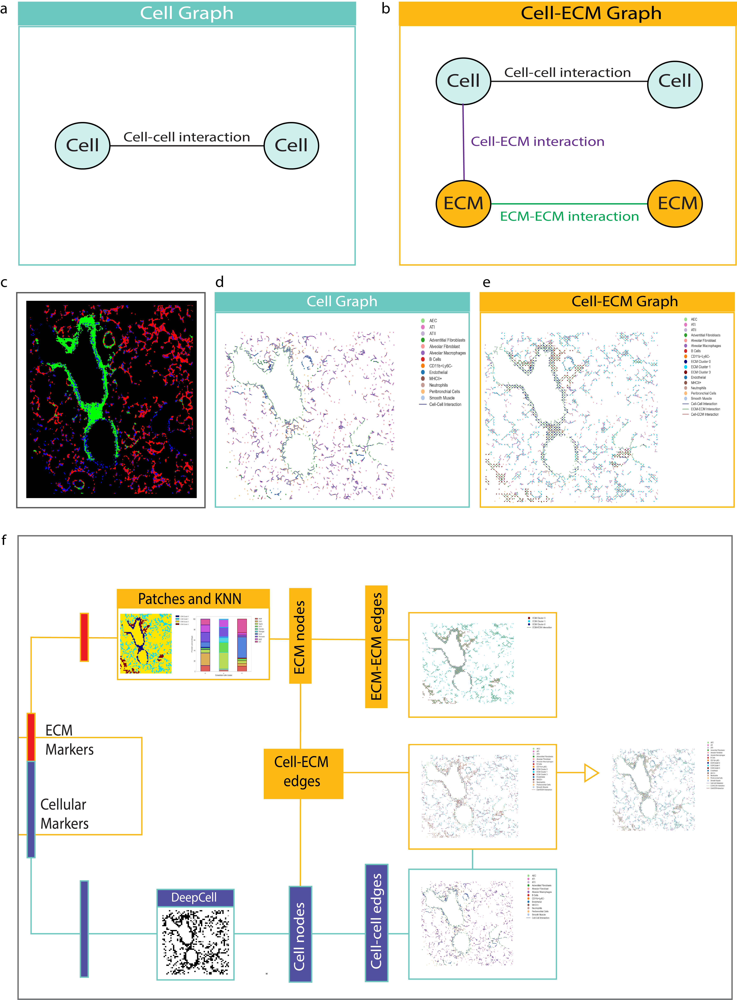

# Cell-ECM-Graphs

As an extention of traditional cell graphs, we present a novel framework called cell-ECM graphs, which incorporates both cellular and ECM components into a single graph, allowing for the analysis of cell-cell, ECM-ECM, and cell-ECM interactions. 

## Cell-ECM graphs was developed on Python 3.12.3
## Usage Examples
### Python Notebook: 
For a simple tutorial using a single ROI in Python, refer to the [Lung_CEG notebook](tutorial/Lung_single_ROI.ipynb).

### Command Line:  
Can be used to process multiple ROIs easily:

#### Step 1: 

Reference: 
